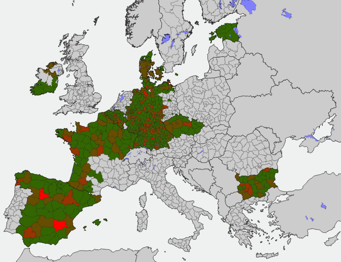

Intro
==========================
concentrationMetrics is a python library for the computation of various concentration, diversification and inequality indices. The library implements the computation of all well known indexes of inequality and concentration. 

You can use concentrationMetrics to

- access an exhaustive collection of concentration, inequality and diversity indexes and metrics
- perform file input/output in both json and csv formats
- compute indexes with confidence intervals via bootstraping
- visualize using matplotlib

Key Information
================

* Author: [Open Risk](<https://www.openriskmanagement.com>)
* License: MIT
* Mathematical Documentation: [Open Risk Manual](<https://www.openriskmanual.org/wiki/Category:Concentration_Index>)
* Code Documentation: [Read The Docs](https://concentrationmetrics.readthedocs.io/en/latest/index.html)
* Development website: [Github](https://github.com/open-risk/concentrationMetrics)
* General Discussions: [Open Risk Commons](https://www.openriskcommons.org/c/open-source/concentrationmetrics/17)
* Package Specific Chat: [Gitter Project](https://gitter.im/open-risk/concentrationMetrics)

**NB: concentrationMetrics is still in active development. If you encounter issues please raise them in our github repository**

[Full Description](DESCRIPTION.rst)

List of Implemented Indexes
===============================
An overview of the implemented metrics (indexes) and their relationships is available at the [Open Risk Manual](https://www.openriskmanual.org/wiki/Concentration_Index)

The below list provides more specific documentation URL's for each one of the implement indexes:

* [Atkinson Index](https://www.openriskmanual.org/wiki/Atkinson_Index)
* [Berger-Parker Index](https://www.openriskmanual.org/wiki/Berger-Parker_Index)
* [Concentration Ratio](https://www.openriskmanual.org/wiki/Concentration_Ratio)
* [Ellison-Glaeser Index](https://www.openriskmanual.org/wiki/Ellison-Glaeser_Index)
* [Gini Index](https://www.openriskmanual.org/wiki/Gini_Index)
* [Theil Index](https://www.openriskmanual.org/wiki/Theil_Index)
* [Hannah-Kay Index](https://www.openriskmanual.org/wiki/Hannah_Kay_Index)
* [Hoover Index](https://www.openriskmanual.org/wiki/Hoover_Index)
* [Herfindahl-Hirschman Index](https://www.openriskmanual.org/wiki/Herfindahl-Hirschman_Index) and related indexes such as Simpson and Inverse Simpson
* [Shannon Index](https://www.openriskmanual.org/wiki/Shannon_Index)
* [Generalized Entropy Index (Renyi)](https://www.openriskmanual.org/wiki/Generalized_Entropy_Index)
* [Kolm Index](https://www.openriskmanual.org/wiki/Kolm_Index)

Support and Training
=========================
The Open Risk Academy has free courses demonstrating the use of the library: [Open Risk Academy](https://www.openriskacademy.com)

Examples
========
Comparing two indexes across a range of input portfolio data 

Calculating industrial and geographic concentrations

Contributions
=============
* Check the [TODO list](docs/source/todo.rst) for immediate TODO items
* Check the [Roadmap](docs/source/roadmap.rst) for the bigger picture
