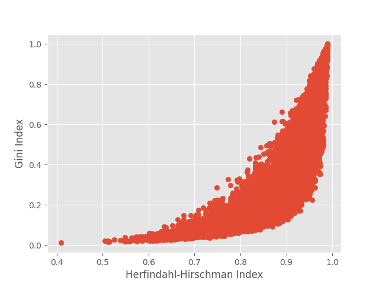

Concentration Library (CL)
==========================

A python library for the computation of various concentration, diversification and inequality indices.

The library implements the computation of all well known indexes of inequality and concentration. 

* Author: Open Risk, <https://www.openriskmanagement.com>
* License: MIT
* Documentation: Open Risk Manual, <https://www.openriskmanual.org/wiki/Category:Concentration_Index>
* Training: Open Risk Academy, <https://www.openriskacademy.com/login/index.php>
* Development website: <https://github.com/open-risk/concentration_library>
* Production instance (API): <https://www.opencpm.com>

List of Implemented Indexes
===============================

An overview of the implemented metrics is available at the [Open Risk Manual](https://www.openriskmanual.org/wiki/Concentration_Index)

The below list provides specific documentation URL's for each one of the implement indexes

* [Atkinson Index](https://www.openriskmanual.org/wiki/Atkinson_Index)
* [Berger-Parker Index](https://www.openriskmanual.org/wiki/Berger-Parker_Index)
* [Concentration Ratio](https://www.openriskmanual.org/wiki/Concentration_Ratio)
* [Ellison-Glaeser Index](https://www.openriskmanual.org/wiki/Ellison-Glaeser_Index)
* [Gini Index](https://www.openriskmanual.org/wiki/Gini_Index)
* [Theil Index](https://www.openriskmanual.org/wiki/Theil_Index)
* [Hannah-Kay Index](https://www.openriskmanual.org/wiki/Hannah_Kay_Index)
* [Hoover Index](https://www.openriskmanual.org/wiki/Hoover_Index)
* [Herfindahl-Hirschman Index](https://www.openriskmanual.org/wiki/Herfindahl-Hirschman_Index)
* [Shannon Index](https://www.openriskmanual.org/wiki/Shannon_Index)
* [Generalized Entropy Index (Renyi)](https://www.openriskmanual.org/wiki/Generalized_Entropy_Index)
* [Kolm Index](https://www.openriskmanual.org/wiki/Kolm_Index)

[Full Description](DESCRIPTION.rst)

Examples
========

Comparing two indexes for 

Calculating industrial and geographic concentrations

Contributions
=============

Check the [TODO list](TODO.rst) for ideas of where to take this library next
